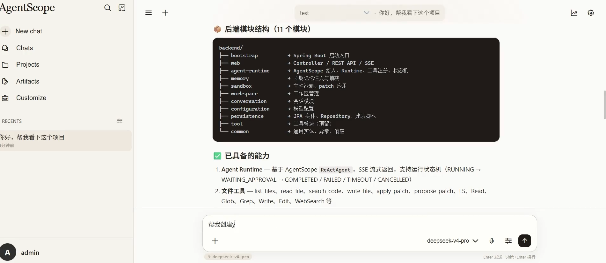
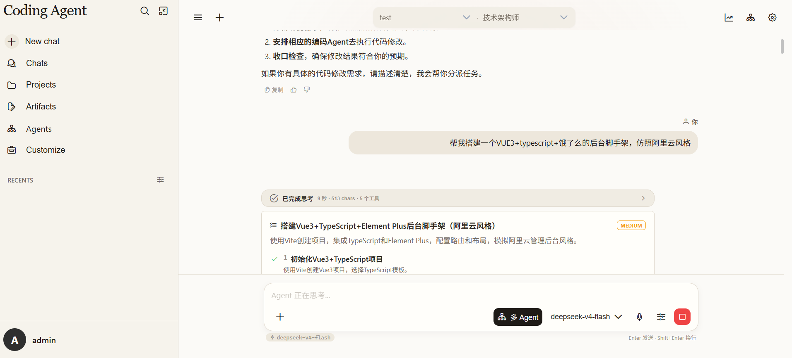
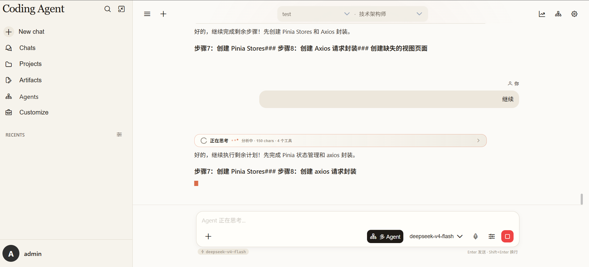

## 🎬 项目演示

[](https://ai.sugeapi.cn/files/video/demo-small.mp4)

> 点击上方图片查看完整演示视频。

## 🧭 界面与编排

### 多 Agent 编排



### 运行状态恢复



# Java AgentScope Coding Agent

一个基于 **Java + Spring Boot + AgentScope Java** 的网页版 Coding Agent 实验项目。

项目目标不是简单做一个聊天机器人，而是探索一个真实 Coding Agent Runtime 应该具备的核心能力：

- Agent Loop
- Workspace 沙箱
- 文件工具调用
- SSE 流式事件
- 运行状态机
- AgentScope checkpoint
- 长期记忆
- 多 Agent 协作与图式编排
- Workspace 内直接文件修改与 Patch 应用
- 前端可观测运行轨迹

当前项目适合用于学习和二次开发，仍处于 MVP / 实验阶段，不建议直接作为生产系统使用。

## 项目定位

这个项目希望做成一个浏览器里的 Coding Agent，体验上接近 opencode、Claude Code、Codex 这类工具，但技术栈选择 Java：

```text
Vue3 前端
  -> Spring Boot 后端
      -> AgentScope Java ReActAgent
          -> Workspace Tools
          -> Sandbox
          -> Memory
          -> SSE Runtime Events
```

核心设计原则：

```text
AgentScope 负责 Agent Loop。
平台负责 workspace、sandbox、memory、orchestration、persistence 和 frontend state。
```

## 当前能力

### Agent Runtime

- 基于 AgentScope Java `ReActAgent`
- OpenAI-compatible 模型配置
- SSE 流式返回
- AgentScope `streamEvents` 转平台 `RuntimeEvent`
- 模型调用、思考阶段、回答增量、工具调用、工具结果展示
- Redis SessionKey / AgentState checkpoint
- 可中断运行：前端停止生成会通知后端取消当前 run
- DSML 工具调用文本过滤，避免模型把内部 tool call 协议直接渲染到聊天正文
- 运行状态机：
  - `RUNNING`
  - `COMPLETED`
  - `FAILED`
  - `TIMEOUT`
  - `CANCELLED`

### Multi-Agent Orchestration

- 支持自定义 Agent：名称、描述、系统提示词、Skills、MCP 服务、模型配置、最大迭代次数和超时时间
- 支持聊天页选择 Agent，并提供多 Agent 协作入口
- 新增轻量图编排器 `AgentGraph`，支持 `addNode`、`addEdge`、`addConditionalEdge`
- Router / Planner / Executor 通过图式编排串联
- Planner 可读取当前工作区可用 Agent，并为计划步骤分配 `agentId`、`agentRole`、`modelConfigId`、`modelName`
- Executor 执行计划步骤时可临时切换到对应专家 Agent 的 prompt 和模型配置
- 计划卡片支持步骤状态恢复、逐步执行、取消运行和专家/模型展示

### Workspace Tools

已接入的工具包括：

```text
list_files
read_file
search_code
write_file
apply_patch
propose_patch
propose_file_change
LS
Read
Glob
Grep
Write
Edit
WebSearch
```

其中 `LS / Read / Glob / Grep / Write / Edit` 是为了贴近 Claude Code / Codex 风格的工具命名。

### Workspace 与工具治理

当前工具权限策略偏向开发效率：不再做工具审批，只做 workspace 边界校验。

- workspace root 边界限制
- 路径归一化
- 路径逃逸拦截
- 二进制文件读取/写入拦截
- 大文件读取限制
- patch 应用路径校验
- Bash 工作目录必须位于当前 workspace 内
- Bash 命令输出截断和超时控制

### Memory

当前实现了长期记忆的第一版：

- 只注入 `ACTIVE` 记忆
- 注入数量和字符预算控制
- 运行结束后规则捕获候选记忆
- 明确“记住”的低风险记忆自动 `ACTIVE`
- 普通“以后/后续/每次”类表达进入 `PENDING`
- 同 key 已有 `ACTIVE` 且内容不同的新记忆进入 `CONFLICT`

### Frontend

前端使用：

- Vue 3
- TypeScript
- Vite
- Pinia
- PrimeVue
- SSE fetch stream

当前页面包含：

- workspace 注册和选择
- 会话列表
- Chat 面板
- 工具调用折叠展示
- 思考状态展示
- 计划卡片与多 Agent 执行状态展示
- Agent 创建与配置页面
- Runtime event 面板
- Timing 面板
- Diff review 组件
- Memory 面板雏形

## 技术栈

### Backend

- Java 17+
- Spring Boot 4
- Maven 多模块
- Spring MVC + `SseEmitter`
- Spring Data JPA
- MySQL
- Redis
- AgentScope Java `2.0.0-RC3`
- Lombok

### Frontend

- Vue 3
- TypeScript
- Vite
- Pinia
- PrimeVue
- Axios
- marked / highlight.js

## 目录结构

```text
java-agentscope-coding-agent
├── backend
│   ├── bootstrap          # Spring Boot 启动模块
│   ├── web                # Controller / Web API / SSE
│   ├── agent-runtime      # AgentScope 接入、Runtime、工具注册、状态机
│   ├── memory             # 长期记忆注入和捕获
│   ├── sandbox            # 文件沙箱、patch 应用
│   ├── workspace          # 工作区管理
│   ├── conversation       # 会话模块
│   ├── configuration      # 模型配置
│   ├── persistence        # JPA 实体、Repository、建表参考脚本
│   ├── tool               # 工具模块预留
│   └── common             # 通用实体、异常、响应
├── frontend               # Vue3 + TypeScript 前端
├── docs                   # 学习和设计文档
│   └── images             # README 和文档截图
├── AGENTS.md              # 给 Coding Agent 的项目约束
└── README.md
```

## 快速启动

### 1. 准备环境

需要：

```text
JDK 17+
Maven 3.9+
Node.js 20+
MySQL 8+
Redis 6+
```

### 2. 配置后端

后端配置文件：

```text
backend/bootstrap/src/main/resources/application.yml
```

至少需要配置：

```yaml
spring:
  datasource:
    url: jdbc:mysql://127.0.0.1:3306/agent_platform?useUnicode=true&characterEncoding=utf8&serverTimezone=Asia/Shanghai&useSSL=false&allowPublicKeyRetrieval=true
    username: root
    password: your-password

agent:
  runtime:
    session:
      enabled: true
      type: redis
      redis:
        uri: redis://127.0.0.1:6379/0
```

首次本地开发可以使用：

```yaml
spring:
  jpa:
    hibernate:
      ddl-auto: update
```

稳定后建议改为 Flyway / Liquibase。

### 3. 启动后端

```bash
cd backend
mvn -pl bootstrap -am spring-boot:run
```

默认后端端口：

```text
http://localhost:8081
```

### 4. 启动前端

```bash
cd frontend
npm install
npm run dev
```

默认前端端口：

```text
http://localhost:5173
```

Vite 已配置代理：

```text
/api -> http://localhost:8081
```

## 使用流程

1. 启动 MySQL、Redis、后端、前端。
2. 在前端注册一个 workspace。
3. 创建或选择模型配置。
4. 创建 Agent。
5. 在 Chat 面板输入任务。
6. Agent 会根据任务决定是否读取文件、搜索代码、修改文件或生成 patch。
7. 前端会展示回答、工具调用、运行事件和耗时。

示例输入：

```text
帮我看一下这个项目的目录结构，并总结后端模块职责。
```

```text
记住：以后改代码必须写中文注释。
```

```text
帮我给某个 Service 方法加一段参数校验。
```

## 主要 API

部分接口仍在快速迭代中，当前主要接口包括：

```text
POST /api/agent-runtime/chat-stream
GET  /api/workspaces
POST /api/workspaces
GET  /api/workspaces/{id}
GET  /api/workspaces/{id}/tree
GET  /api/sessions
POST /api/sessions
POST /api/sessions/{id}/timeline
GET  /api/model-configs
POST /api/model-configs
POST /api/model-configs/test
POST /api/patches/{id}/apply
```

说明：

```text
新增接口优先使用 POST。
部分早期查询接口仍保留 GET，后续会逐步统一。
```

## 数据库设计

核心表：

```text
workspaces
agents
model_configs
conversations
conversation_messages
conversation_summaries
agent_runs
agent_events
tool_calls
approval_requests
patches
patch_files
memory_entries
memory_conflicts
```

参考建表脚本：

```text
backend/persistence/src/main/resources/schema/mysql/001_coding_agent_schema.sql
```

当前开发阶段主要依赖 JPA `ddl-auto=update`。

## 设计文档

建议按顺序阅读：

```text
docs/00-项目交接说明.md
docs/01-产品目标与MVP.md
docs/02-架构设计.md
docs/03-AgentScope接入设计.md
docs/04-沙箱与工具治理设计.md
docs/05-记忆系统设计.md
docs/06-实施路线图.md
docs/07-Coding-Agent学习路线.md
docs/08-SessionKey与AgentState实现记录.md
docs/09-Agent运行体验优化记录.md
docs/10-Agent请求完整生命周期.md
docs/11-运行状态机实现记录.md
docs/12-长期记忆产品化实现记录.md
docs/13-工具权限治理实现记录.md
docs/14-命令级沙箱实现记录.md
docs/15-平台级ToolGuard与Interrupt设计记录.md
docs/16-多Agent第一轮实现记录.md
```

如果你希望让 AI Coding Agent 继续接手本项目，请先阅读：

```text
AGENTS.md
```

## 当前边界

已经具备：

- 基础 AgentScope Runtime
- 文件工具
- workspace 边界校验
- SSE 事件流
- 前端工具调用轨迹
- Redis checkpoint
- Agent Run 状态机
- 长期记忆注入和规则捕获
- patch proposal / apply 基础能力
- Bash workspace 命令工具
- 多 Agent 图式编排
- 自定义 Agent 创建和聊天页选择
- 计划卡片状态恢复、逐步执行和取消运行
- DSML 工具调用文本过滤

尚未完成：

- A2A 协议和 Nacos Agent 注册发现
- 多实例 sessionKey 锁和分布式运行协调
- 并行专家协作、进度合并和 Review Agent
- tool_calls 物化写入
- 前端记忆审核管理
- Session Memory 摘要压缩
- Skill Memory
- 生产级容器沙箱和权限模型
- 生产级密钥管理

## 安全提醒

这是一个 Coding Agent 项目，会读取和修改本地文件。请务必注意：

- 不要把真实 API Key、数据库密码、Redis 地址提交到公开仓库。
- 不要把生产 workspace 直接暴露给 Agent。
- 当前版本为了开发效率已关闭工具审批，仅保留 workspace 边界校验。
- Bash 工具可以在 workspace 内执行命令，但这不是生产级隔离。
- 后续接入 A2A / Nacos / 远程 Agent 时，必须补齐调用鉴权、租户隔离和审计。
- 开源前请检查 `application.yml`、日志、数据库导出、截图中是否包含敏感信息。

## 开源前 Checklist

- [ ] 移除或替换 `application.yml` 中的真实密码和内网/公网地址。
- [ ] 提供 `application-example.yml` 或在 README 中说明本地配置方式。
- [ ] 确认 `.gitignore` 覆盖 `node_modules`、`dist`、`target`、日志和本地配置。
- [ ] 添加 LICENSE。
- [ ] 删除无关 IDE 文件和个人缓存。
- [ ] 确认文档中没有真实 API Key、数据库密码和服务器地址。

## Roadmap

近期计划：

- 记忆审核接口和前端管理
- A2A 协议和 Nacos Agent 注册发现
- 多 Agent 协作进度看板
- Review Agent 与计划执行结果合并
- Bash 输出流式展示
- Session Memory 滑动窗口 + 摘要
- tool_calls 物化写入和更完整的运行审计
- Evaluation / Observability

更长期：

- 远程沙箱或容器隔离
- Git 工作流集成
- 更完整的权限模型和生产级安全治理
- Skills / MCP 市场化管理

## License

暂未指定 License。

如果准备正式开源，建议补充 `LICENSE` 文件，例如 Apache-2.0、MIT 或其他与你目标匹配的协议。
